# 体验改版 v3：现状逐屏截图（模拟器）

为 [任务：模拟器逐屏截图现状](https://github.com/zibyn/stars-outdoor/issues/128) 所做，只记录事实，不评判。

## 环境

- 模拟器 AVD `dbg`：Android 15（API 35），1080×2400，420 dpi；debug 构建，main @ 3ac5be5；浅色。
- GPS 用 `adb emu geo fix` 模拟（太白山一带），只在发送时有定位，所以多处出现「正在定位」状态条，属模拟器所致。
- 第一轮截图时天气、建队、加入都失败，当时在线搜索却是好的；网络与服务端都正常（本机 curl、模拟器 DNS/TCP、模拟器 Chrome 均通），原因未查明，见 bug issue。重装后补截了「⑧ 连上服务端后补截」一节。
- 导入用一个自造的 GPX（60 点、1 个航点、`<trk><name>太白山南坡</name>`）。
- 每屏下方是 uiautomator 读到的文字和位置（[x1,y1][x2,y2]，像素）；`C` 表示可点击。为省篇幅，规划状态首屏常驻的 10 个按钮名从后续各屏中滤掉了。

## 索引

- 1-01-first-launch
- 1-02-location-permission-dialog
- 1-03-after-location-grant
- 1-04-locate-follow
- 3-01-start-tap
- 3-02-active-moving
- 3-03-quick-waypoint
- 3-04-after-waypoint
- 3-05-paused
- 3-06-data-page2
- 3-07-more
- 3-08-share-location
- 3-09-end-short-press
- 3-10-after-end
- 3-11-detail-expanded
- 3-12-detail-scrolled
- 2-05-track-weather
- 2-06-download-along
- 2-01-search-empty
- 2-02-search-latin
- 2-03-weather
- 2-04-weather-scrolled
- 2-07-layers
- 2-08-layers-scrolled
- 4-01-team
- 4-02-create-team
- 4-03-after-back
- 4-04-join-code-tap
- 4-05-join-code-after-6s
- 4-06-note
- 5-01-my-tracks
- 5-02-waypoints-tab
- 5-03-new-group
- 2-09-map-longpress
- 5-04-overlay-tap
- 5-05-track-longpress（长按与点按同样打开轨迹详情）
- 5-07-after-import
- 6-01-offline-maps
- 6-02-settings
- 6-03-battery-guide
- 6-04-account
- 6-05-get-code-no-server
- 6-06-about
- 7-01-offline-map-home
- 7-02-offline-search
- 7-03-offline-satellite
- 7-04-location-off-offline
- 7-05-start-location-off
- 7-06-end-empty-recording
- 7-07-empty-tracks
- 7-08-touch-through（观察：在「我的轨迹」页点空白处 (985,2052)，触发了下层地图的「标注」按钮，页上弹出「已标注」）
- 7-09-empty-offline
- 7-10-empty-waypoints

## 截图过程中观察到的事实（未判断原因）

- 首次打开没有介绍页；进入即是规划状态首屏，顶部黄色状态条「没有定位权限，记录不到轨迹 · 点这里开启」，点后弹系统定位权限框。
- 首次开始记录时没有请求通知权限（Android 15），之后查询 POST_NOTIFICATIONS 为未授予；也没有出现电池引导。
- 记录中：数据栏可左右滑两页（第 1 页 已走 / 用时 / 爬升 / 海拔，第 2 页 配速 / 均速 / 最高海拔 / 电量）；第 2 页配速的标签为「km 用时」。
- 模拟走了约 1.1 km、约 30 s，「用时」一直显示 0:00；结束后轨迹详情的用时也是 0:00。导入的无时间轨迹用时同样显示 0:00。
- 海拔一栏一直显示 3500，而爬升累计到 96 m、最高海拔 3596。
- 一键标注后底部出现「已标注 · 撤销 · 补充」，地图上当前位置附近看不到标注的点（可能被位置点盖住）。
- 暂停后底部变为 继续 / 按住结束 / 标注；短按「按住结束」提示「按住 1 秒结束记录」。结束后自动打开刚记录的轨迹详情。
- 轨迹详情为底部抽屉；正文顺序：四项数据 → 沿轨位置 → 海拔剖面 → 正向/反向 → 设为参考/叠加到地图 → 沿线离线地图 → 坐标纠偏三选一 → 导出 → 公开到周边路网（附 50 字说明）→ 删除。轨迹名默认是日期时间。
- 导入 GPX 后直接打开轨迹详情，没有「已导入」提示；轨迹名用了文件名 `taibai`，而不是 GPX 里的 `太白山南坡`。
- 「我的轨迹」列表每行只有日期时间和「叠加」按钮，没有距离等数据；长按与点按一样打开详情。
- 在「我的轨迹」页点空白处（右下，地图「标注」按钮的位置），触发了下层地图的一键标注，页面上弹出「已标注」。
- 队伍页为整页，含一段 45 字说明；不登录点「建队」或「加入」后只闪一个 Toast，登录页被队伍页盖住（见 ⑧）。
- 账号页不可达服务端时提示「短信暂时发不出去，过几分钟再获取验证码」。
- 天气无网络时只有一行「暂无天气，联网后再打开」。
- 飞行模式下状态条「离线中：已下载的地图和记录照常可用」；搜索「没有找到（没有网络）」（已导入离线底图但无地名索引）；切卫星后状态条「卫星图离线用不了 · 切到地形」，并显示「+1」表示还有一条状态被折叠。
- 定位关闭时仍可开始记录；结束后保存了一条 0 m 的轨迹并提示「已保存 · 0 m」。
- 清除应用数据后，离线地图页仍列出 3 个 pmtiles 文件（共 20 MB）。
- 设置页：惯用手、地图缓存（含 40 字说明）、防止后台停掉记录（弹窗，约 80 字）、账号与同步、关于。关于页 6 段数据来源文字，版本显示为「（1）」。
- 规划状态首屏：右上 搜索 / 天气 / 图层 三个圆形图标钮；右下 定位 / 标注；底栏 我的轨迹 / 队伍 / 开始（居中大绿钮）/ 离线地图 / 设置。活动状态：顶部深色数据栏，左侧 队伍 / 分享位置 / 更多，右侧 图层 / 放大 / 缩小 / 定位，底部 暂停 / 标注 两个大键。

## ① 首次打开
### 1-01-first-launch
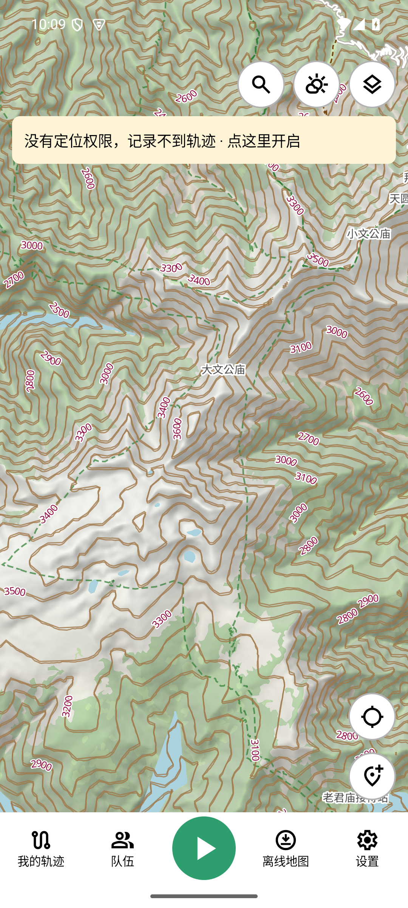
```
'Map'  [0,0][1080,2400]
'' C [628,160][754,286]
'搜索'  [660,192][723,255]
'' C [775,160][901,286]
'天气'  [807,192][870,255]
'' C [922,160][1048,286]
'图层'  [954,192][1017,255]
'' C [32,307][1048,433]
'没有定位权限，记录不到轨迹 · 点这里开启'  [64,342][1016,398]
'' C [922,1831][1048,1957]
'定位：未跟随'  [954,1863][1017,1926]
'' C [922,1989][1048,2115]
'标注'  [954,2021][1017,2084]
'' C [0,2169][216,2316]
'我的轨迹'  [46,2252][170,2297]
'' C [216,2169][432,2316]
'队伍'  [293,2252][355,2297]
'' C [456,2158][624,2326]
'开始'  [493,2195][588,2290]
'' C [648,2169][864,2316]
'离线地图'  [694,2252][818,2297]
'' C [864,2169][1080,2316]
'设置'  [941,2252][1003,2297]
```
### 1-02-location-permission-dialog
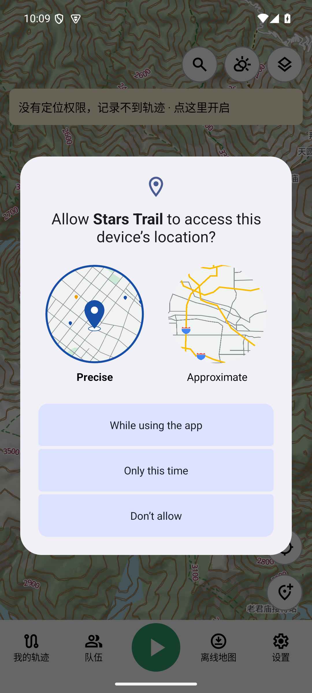
```
'' C [28,500][1052,1964]
'' C [28,500][1052,1964]
'Allow Stars Trail to access this device’s location?'  [133,721][947,854]
'Precise' C [157,917][498,1330]
'Approximate' C [582,917][923,1330]
'While using the app' C [133,1398][947,1545]
'Only this time' C [133,1555][947,1702]
'Don’t allow' C [133,1712][947,1859]
```
### 1-03-after-location-grant
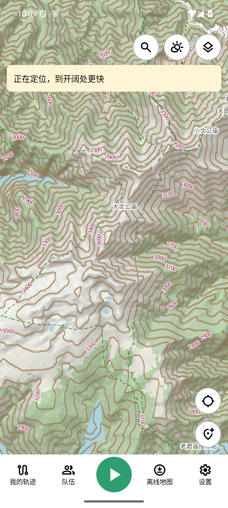
```
'Map'  [0,0][1080,2400]
'' C [628,160][754,286]
'搜索'  [660,192][723,255]
'' C [775,160][901,286]
'天气'  [807,192][870,255]
'' C [922,160][1048,286]
'图层'  [954,192][1017,255]
'' C [922,1831][1048,1957]
'定位：未跟随'  [954,1863][1017,1926]
'' C [922,1989][1048,2115]
'标注'  [954,2021][1017,2084]
'' C [0,2169][216,2316]
'我的轨迹'  [46,2252][170,2297]
'' C [216,2169][432,2316]
'队伍'  [293,2252][355,2297]
'' C [456,2158][624,2326]
'开始'  [493,2195][588,2290]
'' C [648,2169][864,2316]
'离线地图'  [694,2252][818,2297]
'' C [864,2169][1080,2316]
'设置'  [941,2252][1003,2297]
```
### 1-04-locate-follow
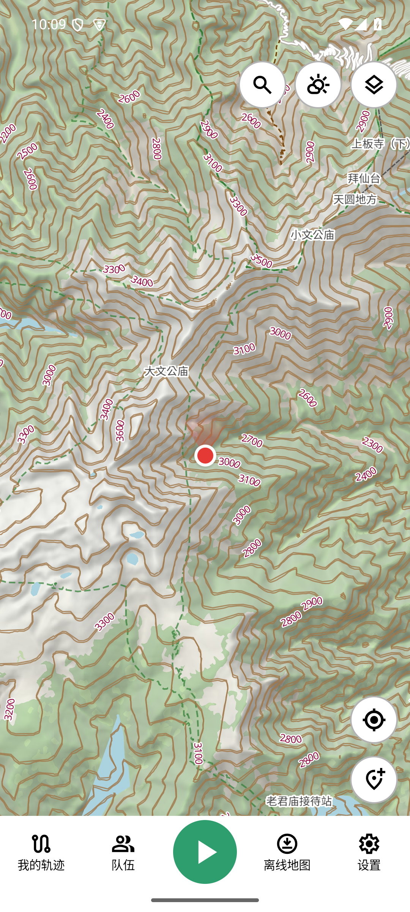
```
'Map'  [0,0][1080,2400]
'' C [628,160][754,286]
'搜索'  [660,192][723,255]
'' C [775,160][901,286]
'天气'  [807,192][870,255]
'' C [922,160][1048,286]
'图层'  [954,192][1017,255]
'' C [922,1831][1048,1957]
'定位：跟随'  [954,1863][1017,1926]
'' C [922,1989][1048,2115]
'标注'  [954,2021][1017,2084]
'' C [0,2169][216,2316]
'我的轨迹'  [46,2252][170,2297]
'' C [216,2169][432,2316]
'队伍'  [293,2252][355,2297]
'' C [456,2158][624,2326]
'开始'  [493,2195][588,2290]
'' C [648,2169][864,2316]
'离线地图'  [694,2252][818,2297]
'' C [864,2169][1080,2316]
'设置'  [941,2252][1003,2297]
```

## ③ 记录
### 3-01-start-tap
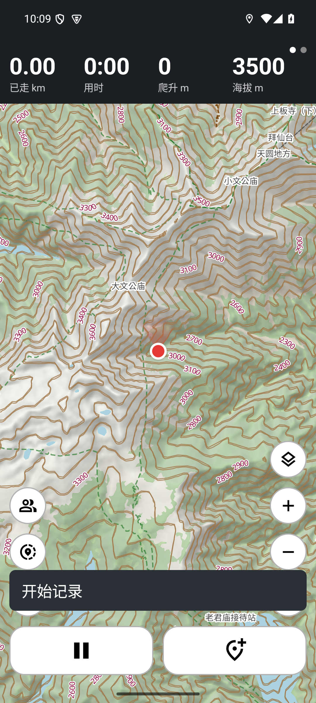
```
'Map'  [0,0][1080,2400]
'' C [0,128][1080,354]
'0.00'  [32,181][190,273]
'已走 km'  [32,273][155,322]
'0:00'  [286,181][443,273]
'用时'  [286,273][354,322]
'0'  [540,181][585,273]
'爬升 m'  [540,273][646,322]
'3500'  [794,181][974,273]
'海拔 m'  [794,273][900,322]
'' C [32,1663][158,1789]
'队伍'  [64,1695][127,1758]
'' C [32,1821][158,1947]
'分享位置'  [64,1853][127,1916]
'' C [32,1979][158,2105]
'更多'  [64,2011][127,2074]
'' C [922,1505][1048,1631]
'图层'  [954,1537][1017,1600]
'' C [922,1663][1048,1789]
'放大'  [954,1695][1017,1758]
'' C [922,1821][1048,1947]
'缩小'  [954,1853][1017,1916]
'' C [922,1979][1048,2105]
'定位：跟随'  [954,2011][1017,2074]
'' C [32,2137][524,2305]
'暂停'  [236,2179][320,2263]
'' C [556,2137][1048,2305]
'标注'  [760,2179][844,2263]
```
### 3-02-active-moving
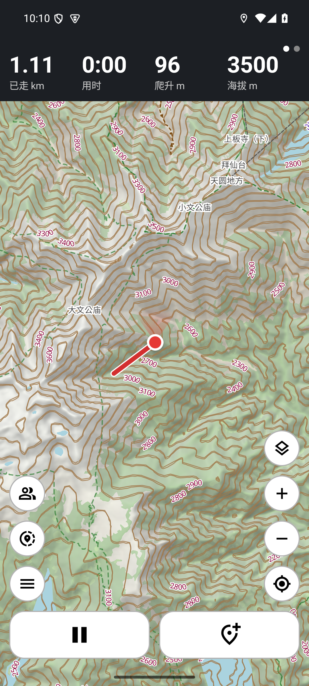
```
'Map'  [0,0][1080,2400]
'' C [0,128][1080,354]
'1.11'  [32,181][190,273]
'已走 km'  [32,273][155,322]
'0:00'  [286,181][443,273]
'用时'  [286,273][354,322]
'96'  [540,181][630,273]
'爬升 m'  [540,273][646,322]
'3500'  [794,181][974,273]
'海拔 m'  [794,273][900,322]
'' C [32,1663][158,1789]
'队伍'  [64,1695][127,1758]
'' C [32,1821][158,1947]
'分享位置'  [64,1853][127,1916]
'' C [32,1979][158,2105]
'更多'  [64,2011][127,2074]
'' C [922,1505][1048,1631]
'图层'  [954,1537][1017,1600]
'' C [922,1663][1048,1789]
'放大'  [954,1695][1017,1758]
'' C [922,1821][1048,1947]
'缩小'  [954,1853][1017,1916]
'' C [922,1979][1048,2105]
'定位：跟随'  [954,2011][1017,2074]
'' C [32,2137][524,2305]
'暂停'  [236,2179][320,2263]
'' C [556,2137][1048,2305]
'标注'  [760,2179][844,2263]
```
### 3-03-quick-waypoint
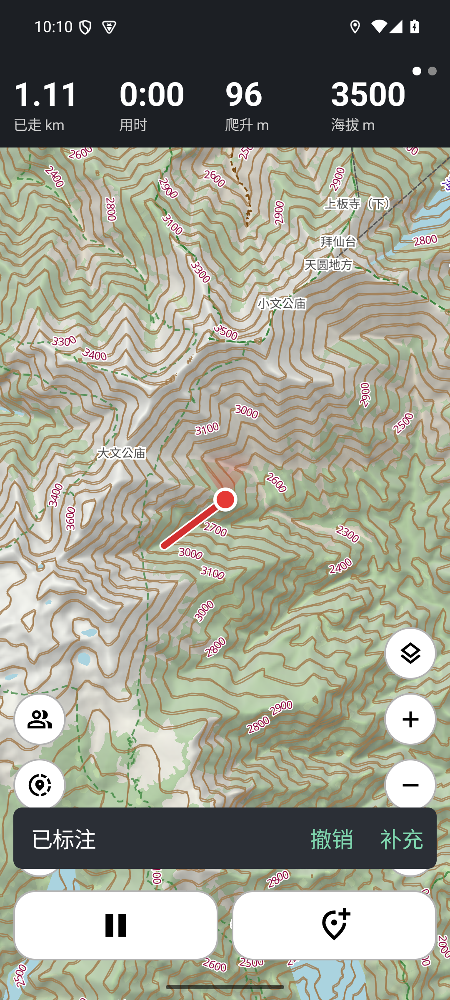
```
'Map'  [0,0][1080,2400]
'' C [0,128][1080,354]
'1.11'  [32,181][190,273]
'已走 km'  [32,273][155,322]
'0:00'  [286,181][443,273]
'用时'  [286,273][354,322]
'96'  [540,181][630,273]
'爬升 m'  [540,273][646,322]
'3500'  [794,181][974,273]
'海拔 m'  [794,273][900,322]
'' C [32,1663][158,1789]
'队伍'  [64,1695][127,1758]
'' C [32,1821][158,1947]
'分享位置'  [64,1853][127,1916]
'' C [32,1979][158,2105]
'更多'  [64,2011][127,2074]
'' C [922,1505][1048,1631]
'图层'  [954,1537][1017,1600]
'' C [922,1663][1048,1789]
'放大'  [954,1695][1017,1758]
'' C [922,1821][1048,1938]
'缩小'  [954,1853][1017,1916]
'' C [922,2085][1048,2105]
'' C [32,2137][524,2305]
'暂停'  [236,2179][320,2263]
'' C [556,2137][1048,2305]
'标注'  [760,2179][844,2263]
'已标注'  [74,1974][712,2049]
'撤销' C [712,1938][880,2085]
'补充' C [880,1938][1048,2085]
```
### 3-04-after-waypoint
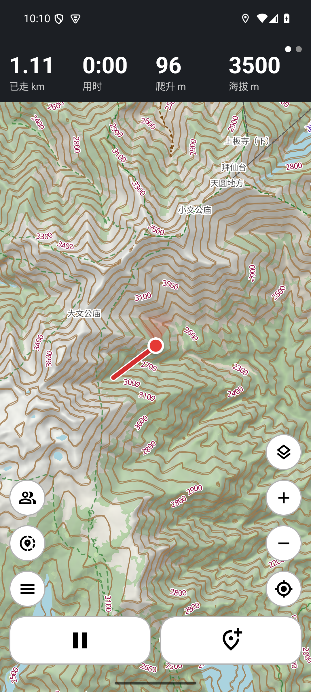
```
'Map'  [0,0][1080,2400]
'' C [0,128][1080,354]
'1.11'  [32,181][190,273]
'已走 km'  [32,273][155,322]
'0:00'  [286,181][443,273]
'用时'  [286,273][354,322]
'96'  [540,181][630,273]
'爬升 m'  [540,273][646,322]
'3500'  [794,181][974,273]
'海拔 m'  [794,273][900,322]
'' C [32,1663][158,1789]
'队伍'  [64,1695][127,1758]
'' C [32,1821][158,1947]
'分享位置'  [64,1853][127,1916]
'' C [32,1979][158,2105]
'更多'  [64,2011][127,2074]
'' C [922,1505][1048,1631]
'图层'  [954,1537][1017,1600]
'' C [922,1663][1048,1789]
'放大'  [954,1695][1017,1758]
'' C [922,1821][1048,1947]
'缩小'  [954,1853][1017,1916]
'' C [922,1979][1048,2105]
'定位：跟随'  [954,2011][1017,2074]
'' C [32,2137][524,2305]
'暂停'  [236,2179][320,2263]
'' C [556,2137][1048,2305]
'标注'  [760,2179][844,2263]
```
### 3-05-paused
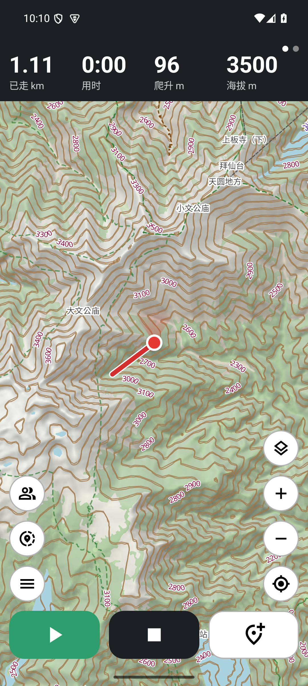
```
'Map'  [0,0][1080,2400]
'' C [0,128][1080,354]
'1.11'  [32,181][190,273]
'已走 km'  [32,273][155,322]
'0:00'  [286,181][443,273]
'用时'  [286,273][354,322]
'96'  [540,181][630,273]
'爬升 m'  [540,273][646,322]
'3500'  [794,181][974,273]
'海拔 m'  [794,273][900,322]
'' C [32,1663][158,1789]
'队伍'  [64,1695][127,1758]
'' C [32,1821][158,1947]
'分享位置'  [64,1853][127,1916]
'' C [32,1979][158,2105]
'更多'  [64,2011][127,2074]
'' C [922,1505][1048,1631]
'图层'  [954,1537][1017,1600]
'' C [922,1663][1048,1789]
'放大'  [954,1695][1017,1758]
'' C [922,1821][1048,1947]
'缩小'  [954,1853][1017,1916]
'' C [922,1979][1048,2105]
'定位：跟随'  [954,2011][1017,2074]
'' C [32,2137][350,2305]
'继续'  [149,2179][233,2263]
'按住结束' C [382,2137][699,2305]
'' C [731,2137][1048,2305]
'标注'  [848,2179][932,2263]
```
### 3-06-data-page2
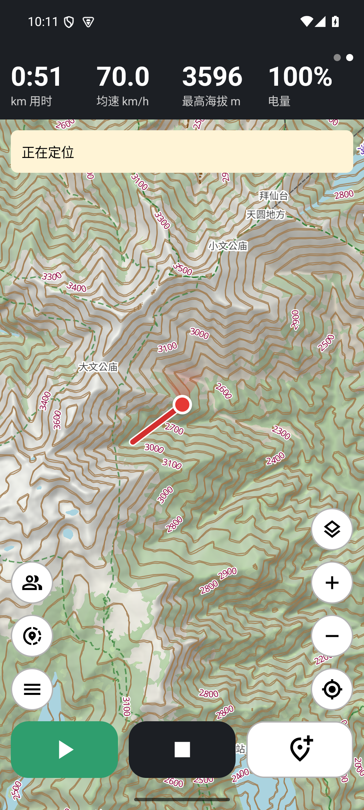
```
'Map'  [0,0][1080,2400]
'0:51'  [32,181][189,273]
'km 用时'  [32,273][155,322]
'70.0'  [286,181][444,273]
'均速 km/h'  [286,273][442,322]
'3596'  [540,181][720,273]
'最高海拔 m'  [540,273][714,322]
'100%'  [794,181][987,273]
'电量'  [794,273][862,322]
'正在定位'  [64,421][1016,477]
'队伍'  [64,1695][127,1758]
'分享位置'  [64,1853][127,1916]
'更多'  [64,2011][127,2074]
'图层'  [954,1537][1017,1600]
'放大'  [954,1695][1017,1758]
'缩小'  [954,1853][1017,1916]
'定位：跟随'  [954,2011][1017,2074]
'继续'  [149,2179][233,2263]
'按住结束' C [382,2137][699,2305]
'标注'  [848,2179][932,2263]
```
### 3-07-more
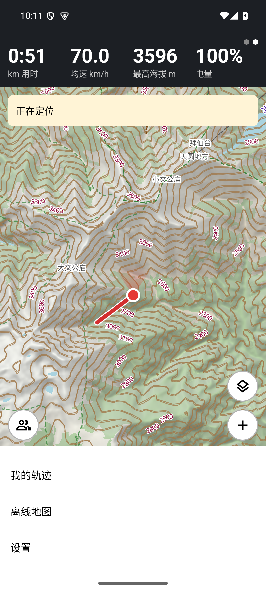
```
'Map'  [0,0][1080,2400]
'0:51'  [32,181][189,273]
'km 用时'  [32,273][155,322]
'70.0'  [286,181][444,273]
'均速 km/h'  [286,273][442,322]
'3596'  [540,181][720,273]
'最高海拔 m'  [540,273][714,322]
'100%'  [794,181][987,273]
'电量'  [794,273][862,322]
'正在定位'  [64,421][1016,477]
'队伍'  [64,1695][127,1758]
'分享位置'  [64,1853][127,1854]
'图层'  [954,1537][1017,1600]
'放大'  [954,1695][1017,1758]
'缩小'  [954,1853][1017,1854]
'按住结束' C [382,2295][699,2305]
'我的轨迹' C [42,1854][1038,2001]
'离线地图' C [42,2001][1038,2148]
'设置' C [42,2148][1038,2295]
```
### 3-08-share-location
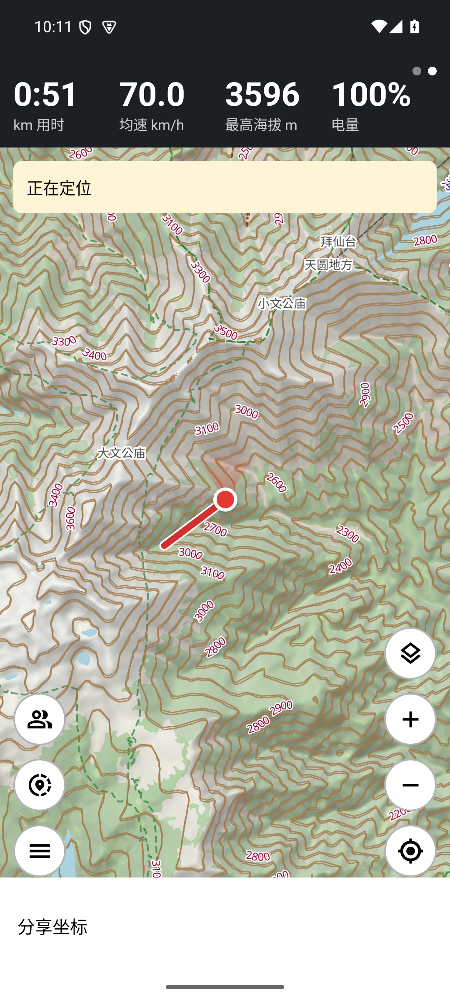
```
'Map'  [0,0][1080,2400]
'0:51'  [32,181][189,273]
'km 用时'  [32,273][155,322]
'70.0'  [286,181][444,273]
'均速 km/h'  [286,273][442,322]
'3596'  [540,181][720,273]
'最高海拔 m'  [540,273][714,322]
'100%'  [794,181][987,273]
'电量'  [794,273][862,322]
'正在定位'  [64,421][1016,477]
'队伍'  [64,1695][127,1758]
'分享位置'  [64,1853][127,1916]
'更多'  [64,2011][127,2074]
'图层'  [954,1537][1017,1600]
'放大'  [954,1695][1017,1758]
'缩小'  [954,1853][1017,1916]
'定位：跟随'  [954,2011][1017,2074]
'按住结束' C [382,2137][699,2305]
'分享坐标' C [42,2148][1038,2295]
```
### 3-09-end-short-press
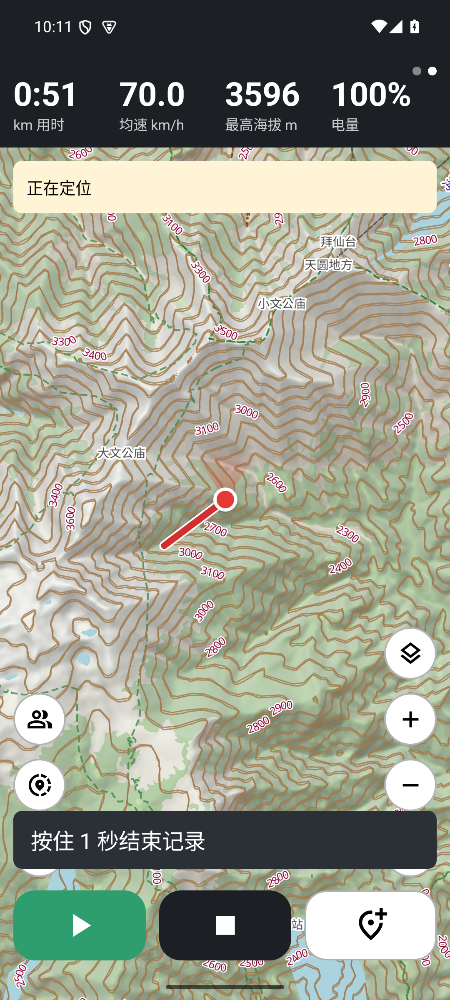
```
'Map'  [0,0][1080,2400]
'0:51'  [32,181][189,273]
'km 用时'  [32,273][155,322]
'70.0'  [286,181][444,273]
'均速 km/h'  [286,273][442,322]
'3596'  [540,181][720,273]
'最高海拔 m'  [540,273][714,322]
'100%'  [794,181][987,273]
'电量'  [794,273][862,322]
'正在定位'  [64,421][1016,477]
'队伍'  [64,1695][127,1758]
'分享位置'  [64,1853][127,1916]
'更多'  [64,2011][127,2074]
'图层'  [954,1537][1017,1600]
'放大'  [954,1695][1017,1758]
'缩小'  [954,1853][1017,1916]
'定位：跟随'  [954,2053][1017,2074]
'继续'  [149,2179][233,2263]
'按住结束' C [382,2137][699,2305]
'标注'  [848,2179][932,2263]
'按住 1 秒结束记录'  [74,1978][1048,2053]
```
### 3-10-after-end
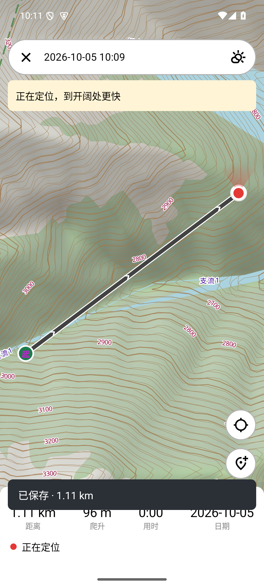
```
'Map'  [0,0][1080,2400]
'关闭轨迹'  [75,203][138,266]
'2026-10-05 10:09'  [180,209][512,258]
'沿途天气'  [943,203][1006,266]
'正在定位，到开阔处更快'  [64,363][1016,419]
'定位：未跟随'  [954,1706][1017,1769]
'标注'  [954,1864][1017,1927]
'1.11 km'  [42,2065][228,2127]
'距离'  [104,2127][166,2172]
'96 m'  [339,2065][456,2127]
'爬升'  [367,2127][429,2172]
'0:00'  [567,2065][667,2127]
'用时'  [586,2127][648,2172]
'2026-10-05'  [778,2065][1038,2127]
'日期'  [877,2127][939,2172]
'正在定位'  [89,2207][245,2263]
```
### 3-11-detail-expanded
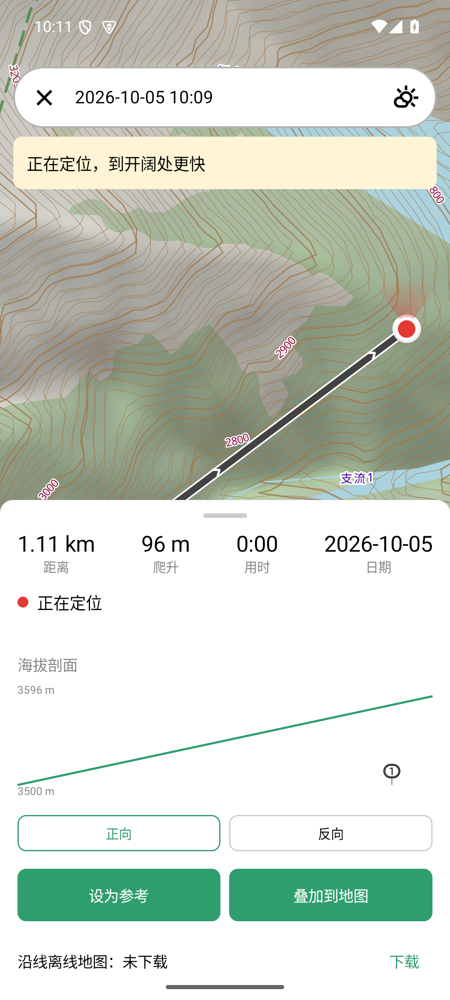
```
'Map'  [0,0][1080,2400]
'关闭轨迹'  [75,203][138,266]
'2026-10-05 10:09'  [180,209][512,258]
'沿途天气'  [943,203][1006,266]
'正在定位，到开阔处更快'  [64,363][1016,419]
'1.11 km'  [42,1275][228,1337]
'距离'  [104,1337][166,1382]
'96 m'  [339,1275][456,1337]
'爬升'  [367,1337][429,1382]
'0:00'  [567,1275][667,1337]
'用时'  [586,1337][648,1382]
'2026-10-05'  [778,1275][1038,1337]
'日期'  [877,1337][939,1382]
'正在定位'  [89,1417][245,1473]
'海拔剖面'  [42,1568][186,1620]
'3596 m'  [42,1641][131,1671]
'3500 m'  [42,1884][131,1914]
'正向' C [42,1937][529,2063]
'反向' C [550,1937][1038,2063]
'设为参考' C [42,2085][529,2211]
'叠加到地图' C [550,2085][1038,2211]
'沿线离线地图：未下载'  [42,2280][902,2332]
'下载' C [902,2232][1038,2358]
```
### 3-12-detail-scrolled

```
'Map'  [0,0][1080,2400]
'关闭轨迹'  [75,203][138,266]
'2026-10-05 10:09'  [180,209][512,258]
'沿途天气'  [943,203][1006,266]
'正在定位，到开阔处更快'  [64,363][1016,419]
'1.11 km'  [42,1275][228,1337]
'距离'  [104,1337][166,1382]
'96 m'  [339,1275][456,1337]
'爬升'  [367,1337][429,1382]
'0:00'  [567,1275][667,1337]
'用时'  [586,1337][648,1382]
'2026-10-05'  [778,1275][1038,1337]
'日期'  [877,1337][939,1382]
'正在定位'  [89,1417][245,1473]
'坐标来自（只在中国境内纠偏）'  [42,1593][546,1645]
'其他（不纠偏）' C [42,1647][360,1773]
'高德或腾讯' C [381,1647][699,1773]
'百度' C [720,1647][1038,1773]
'导出' C [42,1774][1038,1900]
'公开到周边路网' C [42,1921][1038,2047]
'公开后他人可在周边路网看到，起点和终点各 200 m 自动隐藏，可随时撤回；撤回后，别人已保存的副本无法收回'  [42,2058][1038,2148]
'删除' C [42,2148][178,2295]
```

## ② 出发前规划
### 2-05-track-weather
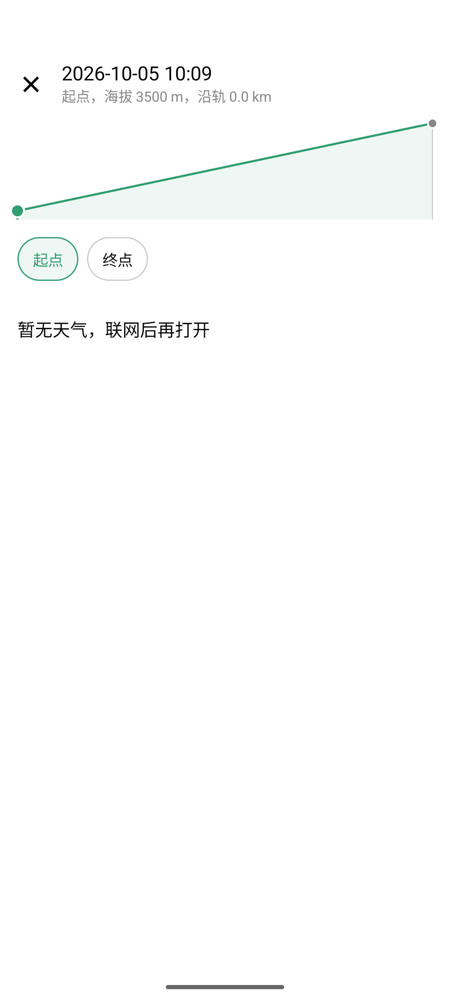
```
'Map'  [0,0][1080,2400]
'关闭轨迹'  [75,203][138,266]
'2026-10-05 10:09'  [180,254][512,258]
'沿途天气'  [943,203][1006,266]
'关闭天气'  [43,171][106,234]
'2026-10-05 10:09'  [148,149][509,205]
'起点，海拔 3500 m，沿轨 0.0 km'  [148,205][652,254]
'起点'  [79,596][151,648]
'终点'  [246,596][318,648]
'暂无天气，联网后再打开'  [42,758][504,819]
```
### 2-06-download-along
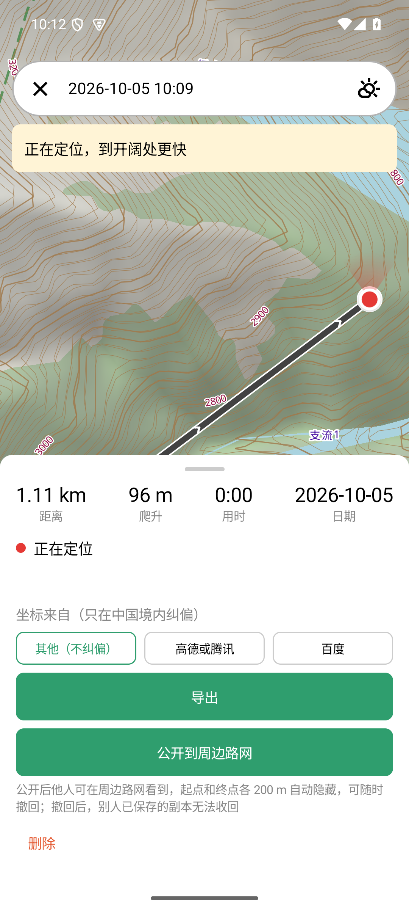
```
'Map'  [0,0][1080,2400]
'关闭轨迹'  [75,203][138,266]
'2026-10-05 10:09'  [180,209][512,258]
'沿途天气'  [943,203][1006,266]
'正在定位，到开阔处更快'  [64,363][1016,419]
'1.11 km'  [42,1275][228,1337]
'距离'  [104,1337][166,1382]
'96 m'  [339,1275][456,1337]
'爬升'  [367,1337][429,1382]
'0:00'  [567,1275][667,1337]
'用时'  [586,1337][648,1382]
'2026-10-05'  [778,1275][1038,1337]
'日期'  [877,1337][939,1382]
'正在定位'  [89,1417][245,1473]
'坐标来自（只在中国境内纠偏）'  [42,1593][546,1645]
'其他（不纠偏）' C [42,1647][360,1773]
'高德或腾讯' C [381,1647][699,1773]
'百度' C [720,1647][1038,1773]
'导出' C [42,1774][1038,1900]
'公开到周边路网' C [42,1921][1038,2047]
'公开后他人可在周边路网看到，起点和终点各 200 m 自动隐藏，可随时撤回；撤回后，别人已保存的副本无法收回'  [42,2058][1038,2148]
'删除' C [42,2148][178,2295]
```
### 2-01-search-empty

```
'Map'  [0,0][1080,2400]
'图层'  [1006,192][1017,255]
'正在定位，到开阔处更快'  [64,342][1016,398]
'定位：未跟随'  [954,1863][1017,1926]
'标注'  [954,2021][1017,2084]
'我的轨迹'  [46,2252][170,2297]
'队伍'  [293,2252][355,2297]
'开始'  [493,2195][588,2290]
'离线地图'  [694,2252][818,2297]
'设置'  [941,2252][1003,2297]
'地名、山峰、景点或坐标'  [74,202][1006,263]
```
### 2-02-search-latin

```
'Map'  [0,0][1080,2400]
'图层'  [1006,192][1017,255]
'taibai' C [74,164][1006,283]
'拔仙台'  [42,309][150,361]
'陕西省 宝鸡市'  [42,361][236,406]
'太白山'  [42,458][150,510]
'陕西省 西安市'  [42,510][236,555]
'太白山国家森林公园'  [42,607][366,659]
'陕西省 宝鸡市'  [42,659][236,704]
'太白县'  [42,756][150,808]
'陕西省 宝鸡市'  [42,808][236,853]
'太白县'  [42,905][150,957]
'陕西省 宝鸡市'  [42,957][236,1002]
'太白河'  [42,1054][150,1106]
'陕西省 宝鸡市'  [42,1106][236,1151]
'太白河镇'  [42,1203][186,1255]
'陕西省 宝鸡市'  [42,1255][236,1300]
'太白河'  [42,1352][150,1404]
'陕西省 留坝县'  [42,1404][236,1449]
'太白'  [42,1501][114,1553]
'甘肃省 高桥镇 徽县'  [42,1553][306,1598]
'太白镇'  [42,1650][150,1702]
'甘肃省 庆阳市'  [42,1702][236,1747]
'太白街道'  [42,1799][186,1851]
'重庆市 万州区'  [42,1851][236,1896]
'太白镇'  [42,1948][150,2000]
'贵州省 遵义市'  [42,2000][236,2045]
'太白'  [42,2097][114,2149]
'安徽省 姚沟镇 无为市'  [42,2149][337,2194]
'太白镇'  [42,2246][150,2295]
```
### 2-03-weather

```
'Map'  [0,0][1080,2400]
'搜索'  [660,192][723,255]
'天气'  [807,192][870,255]
'图层'  [954,192][1017,255]
'正在定位，到开阔处更快'  [546,342][1016,398]
'定位：未跟随'  [954,1863][1017,1926]
'标注'  [954,2021][1017,2084]
'开始'  [546,2195][588,2290]
'离线地图'  [694,2252][818,2297]
'设置'  [941,2252][1003,2297]
'关闭天气'  [43,171][106,234]
'我的位置'  [148,167][336,236]
'暂无天气，联网后再打开'  [42,317][504,378]
```
### 2-04-weather-scrolled

```
'Map'  [0,0][1080,2400]
'搜索'  [660,192][723,255]
'天气'  [807,192][870,255]
'图层'  [954,192][1017,255]
'正在定位，到开阔处更快'  [546,342][1016,398]
'定位：未跟随'  [954,1863][1017,1926]
'标注'  [954,2021][1017,2084]
'开始'  [546,2195][588,2290]
'离线地图'  [694,2252][818,2297]
'设置'  [941,2252][1003,2297]
'关闭天气'  [43,171][106,234]
'我的位置'  [148,167][336,236]
'暂无天气，联网后再打开'  [42,317][504,378]
```
### 2-07-layers
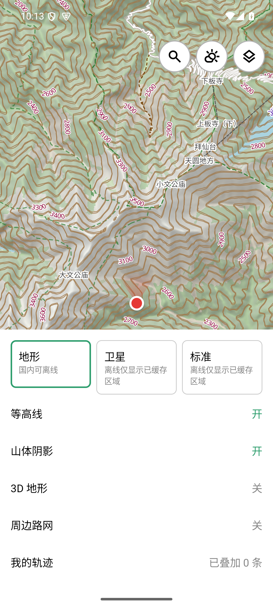
```
'搜索'  [660,192][723,255]
'天气'  [807,192][870,255]
'图层'  [954,192][1017,255]
'我的轨迹'  [46,2295][170,2297]
'队伍'  [293,2295][355,2297]
'离线地图'  [694,2295][818,2297]
'设置'  [941,2295][1003,2297]
'地形'  [74,1377][158,1438]
'国内可离线'  [74,1438][229,1483]
'卫星'  [413,1377][497,1438]
'离线仅显示已缓存区域'  [413,1438][667,1528]
'标准'  [752,1377][836,1438]
'离线仅显示已缓存区域'  [752,1438][1006,1528]
'等高线'  [42,1603][996,1664]
'开'  [996,1603][1038,1664]
'山体阴影'  [42,1750][996,1811]
'开'  [996,1750][1038,1811]
'3D 地形'  [42,1897][996,1958]
'关'  [996,1897][1038,1958]
'周边路网'  [42,2044][996,2105]
'关'  [996,2044][1038,2105]
'我的轨迹'  [42,2191][826,2252]
'已叠加 0 条'  [826,2191][1038,2252]
```
### 2-08-layers-scrolled

```
'搜索'  [660,192][723,255]
'天气'  [807,192][870,255]
'图层'  [954,192][1017,255]
'我的轨迹'  [46,2295][170,2297]
'队伍'  [293,2295][355,2297]
'离线地图'  [694,2295][818,2297]
'设置'  [941,2295][1003,2297]
'地形'  [74,1377][158,1438]
'国内可离线'  [74,1438][229,1483]
'卫星'  [413,1377][497,1438]
'离线仅显示已缓存区域'  [413,1438][667,1528]
'标准'  [752,1377][836,1438]
'离线仅显示已缓存区域'  [752,1438][1006,1528]
'等高线'  [42,1603][996,1664]
'开'  [996,1603][1038,1664]
'山体阴影'  [42,1750][996,1811]
'开'  [996,1750][1038,1811]
'3D 地形'  [42,1897][996,1958]
'关'  [996,1897][1038,1958]
'周边路网'  [42,2044][996,2105]
'关'  [996,2044][1038,2105]
'我的轨迹'  [42,2191][826,2252]
'已叠加 0 条'  [826,2191][1038,2252]
```

## ④ 队伍
### 4-01-team

```
'队伍'  [42,170][156,252]
'一次出行的群聊：聊天、发位置，互相看到在哪。建队后把 4 位加入码告诉队友，队友输入即可加入。'  [42,273][1038,363]
'你在队伍里的称呼（可不填）'  [42,405][510,457]
'建队' C [42,597][1038,723]
'加入码'  [42,760][150,812]
'加入' C [42,952][1038,1078]
```
### 4-02-create-team

```
'队伍'  [42,170][156,252]
'一次出行的群聊：聊天、发位置，互相看到在哪。建队后把 4 位加入码告诉队友，队友输入即可加入。'  [42,273][1038,363]
'你在队伍里的称呼（可不填）'  [42,405][510,457]
'建队' C [42,597][1038,723]
'加入码'  [42,760][150,812]
'加入' C [42,952][1038,1078]
```
### 4-03-after-back

```
'队伍'  [42,170][156,252]
'一次出行的群聊：聊天、发位置，互相看到在哪。建队后把 4 位加入码告诉队友，队友输入即可加入。'  [42,273][1038,363]
'你在队伍里的称呼（可不填）'  [42,405][510,457]
'建队' C [42,597][1038,723]
'加入码'  [42,760][150,812]
'加入' C [42,952][1038,1078]
```
### 4-04-join-code-tap

```
'定位：未跟随'  [954,1863][1017,1926]
'标注'  [954,2021][1017,2084]
'我的轨迹'  [46,2252][170,2297]
'队伍'  [293,2252][355,2297]
'开始'  [493,2195][588,2290]
'离线地图'  [694,2252][818,2297]
'设置'  [941,2252][1003,2297]
'队伍'  [42,170][156,252]
'一次出行的群聊：聊天、发位置，互相看到在哪。建队后把 4 位加入码告诉队友，队友输入即可加入。'  [42,273][1038,363]
'你在队伍里的称呼（可不填）'  [42,405][510,457]
'建队' C [42,597][1038,723]
'加入码'  [42,760][150,812]
'1234' C [74,817][1006,943]
'加入' C [42,952][1038,1078]
```
### 4-05-join-code-after-6s

```
'定位：未跟随'  [954,1863][1017,1926]
'标注'  [954,2021][1017,2084]
'我的轨迹'  [46,2252][170,2297]
'队伍'  [293,2252][355,2297]
'开始'  [493,2195][588,2290]
'离线地图'  [694,2252][818,2297]
'设置'  [941,2252][1003,2297]
'队伍'  [42,170][156,252]
'一次出行的群聊：聊天、发位置，互相看到在哪。建队后把 4 位加入码告诉队友，队友输入即可加入。'  [42,273][1038,363]
'你在队伍里的称呼（可不填）'  [42,405][510,457]
'建队' C [42,597][1038,723]
'加入码'  [42,760][150,812]
'1234' C [74,817][1006,943]
'加入' C [42,952][1038,1078]
```
### 4-06-note
（观察）点「加入」后无任何提示、加载状态或登录页（代码注释写的是先输码后登录）；模拟器 API 指向的服务端不可达。返回键行为因键盘焦点干扰未能可靠复现，不作结论。

## ⑤ 管理
### 5-01-my-tracks

```
'轨迹'  [42,273][540,420]
'标注' C [540,273][1038,420]
'2026-10-05 10:09' C [42,420][849,567]
'叠加' C [849,420][1038,567]
'导入轨迹文件' C [42,2113][1038,2239]
'支持 GPX、KML、FIT、GeoJSON、PLT'  [42,2250][1038,2295]
```
### 5-02-waypoints-tab

```
'轨迹' C [42,273][540,420]
'新建标注组' C [42,420][1038,567]
```
### 5-03-new-group

```
'轨迹' C [42,273][540,420]
'建立' C [902,415][1038,541]
```

## ② 出发前规划
### 2-09-map-longpress
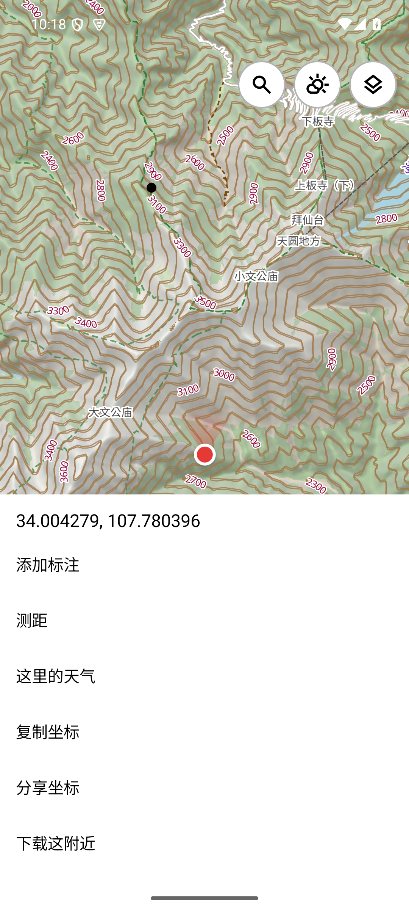
```
'34.004279, 107.780396'  [42,1346][529,1402]
'添加标注' C [42,1413][1038,1560]
'测距' C [42,1560][1038,1707]
'这里的天气' C [42,1707][1038,1854]
'复制坐标' C [42,1854][1038,2001]
'分享坐标' C [42,2001][1038,2148]
'下载这附近' C [42,2148][1038,2295]
```

## ⑤ 管理
### 5-04-overlay-tap

```
'轨迹'  [42,273][540,420]
'标注' C [540,273][1038,420]
'已叠加 1 条'  [42,468][830,520]
'全部取消' C [830,420][1038,567]
'2026-10-05 10:09' C [42,567][849,714]
'已叠加' C [849,567][1038,714]
'导入轨迹文件' C [42,2113][1038,2239]
'支持 GPX、KML、FIT、GeoJSON、PLT'  [42,2250][1038,2295]
```
### 5-05-track-longpress（长按与点按同样打开轨迹详情）
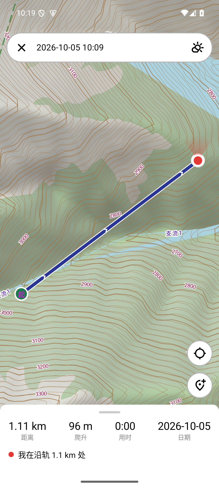
```
'关闭轨迹'  [75,203][138,266]
'2026-10-05 10:09'  [180,209][512,258]
'沿途天气'  [943,203][1006,266]
'1.11 km'  [42,2065][228,2127]
'距离'  [104,2127][166,2172]
'96 m'  [339,2065][456,2127]
'爬升'  [367,2127][429,2172]
'0:00'  [567,2065][667,2127]
'用时'  [586,2127][648,2172]
'2026-10-05'  [778,2065][1038,2127]
'日期'  [877,2127][939,2172]
'我在沿轨 1.1 km 处'  [89,2207][422,2263]
```
### 5-06-import-picker（系统文件选择器）

### 5-07-after-import
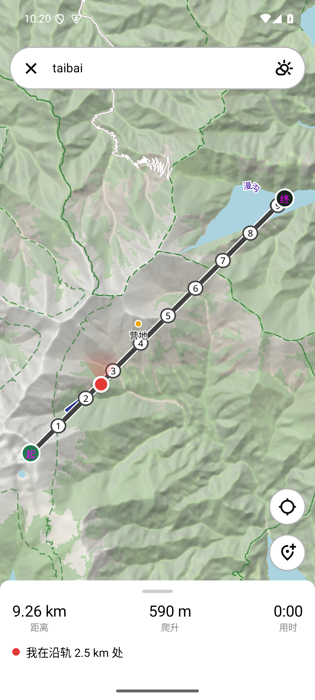
```
'关闭轨迹'  [75,203][138,266]
'taibai'  [180,209][284,258]
'沿途天气'  [943,203][1006,266]
'9.26 km'  [42,2065][228,2127]
'距离'  [104,2127][166,2172]
'590 m'  [510,2065][656,2127]
'爬升'  [552,2127][614,2172]
'0:00'  [938,2065][1038,2127]
'用时'  [957,2127][1019,2172]
'我在沿轨 2.5 km 处'  [89,2207][422,2263]

（观察）GPX 内 <trk><name>太白山南坡</name> 未被采用，轨迹名显示为文件名 taibai；无时间的轨迹「用时」显示 0:00；导入后直接打开轨迹详情，无「已导入」提示。
```

## ⑥ 设置、账号、离线地图
### 6-01-offline-maps
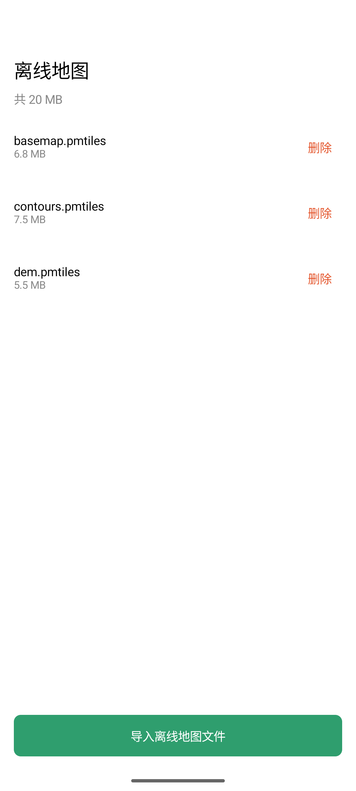
```
'共 20 MB'  [42,273][189,325]
'basemap.pmtiles'  [42,406][322,449]
'6.8 MB'  [42,449][138,486]
'删除' C [902,372][1038,519]
'contours.pmtiles'  [42,605][316,648]
'7.5 MB'  [42,648][138,685]
'删除' C [902,571][1038,718]
'dem.pmtiles'  [42,804][243,847]
'5.5 MB'  [42,847][138,884]
'删除' C [902,770][1038,917]
'导入离线地图文件' C [42,2169][1038,2295]
```
### 6-02-settings

```
'惯用手'  [42,337][660,398]
'右手' C [681,294][849,441]
'左手' C [870,294][1038,441]
'地图缓存 2.2 MB'  [42,505][912,566]
'清除' C [912,473][1038,599]
'上限'  [42,625][114,677]
'256 MB' C [135,588][344,714]
'1 GB' C [365,588][518,714]
'4 GB' C [539,588][692,714]
'在线看过的地方离线时尽力显示，最久未用的先删。缓存不保证离线可用，要离线请下载离线包。'  [42,735][1038,825]
'防止手机在后台停掉记录' C [42,825][1038,972]
'账号与同步' C [42,972][1038,1119]
'关于' C [42,1119][1038,1266]
```
### 6-03-battery-guide

```
'防止手机在后台停掉记录'  [116,729][633,798]
'锁屏后系统可能为了省电停掉记录。请按以下步骤设置：&#10;&#10;在系统设置中允许星径在后台运行，并不受电池优化限制。&#10;&#10;另外请在最近任务里锁定本应用，避免一键清理时被关闭。'  [116,830][964,1228]
'关闭电池优化' C [116,1276][964,1402]
'打开应用设置' C [116,1413][964,1539]
'知道了' C [116,1550][964,1676]
```
### 6-04-account

```
'惯用手'  [42,363][660,398]
'右手' C [681,363][849,441]
'左手' C [870,363][1038,441]
'地图缓存 2.4 MB'  [42,505][74,566]
'清除' C [912,473][1038,597]
'256 MB' C [135,588][344,597]
'1 GB' C [365,588][518,597]
'4 GB' C [539,588][692,597]
'在线看过的地方离线时尽力显示，最久未用的先删。缓存不保证离线可用，要离线请下载离线包。'  [42,735][1038,825]
'防止手机在后台停掉记录' C [42,825][1038,952]
'账号与同步' C [42,1078][1038,1119]
'关于' C [42,1119][1038,1266]
'账号'  [42,170][156,252]
'仅支持中国大陆手机号（+86）。登录后才能使用队伍和同步，其余功能无需登录；未登录时数据只存在本机。'  [42,273][1038,363]
'手机号'  [42,405][150,457]
'获取验证码' C [42,597][1038,723]
'验证码'  [42,760][150,812]
'登录' C [42,952][1038,1078]
```
### 6-05-get-code-no-server

```
'惯用手'  [42,363][660,398]
'右手' C [681,363][849,441]
'左手' C [870,363][1038,441]
'地图缓存 2.4 MB'  [42,505][74,566]
'清除' C [912,473][1038,597]
'256 MB' C [135,588][344,597]
'1 GB' C [365,588][518,597]
'4 GB' C [539,588][692,597]
'在线看过的地方离线时尽力显示，最久未用的先删。缓存不保证离线可用，要离线请下载离线包。'  [42,735][1038,825]
'防止手机在后台停掉记录' C [42,825][1038,952]
'账号与同步' C [42,1078][1038,1119]
'关于' C [42,1119][1038,1266]
'账号'  [42,170][156,252]
'仅支持中国大陆手机号（+86）。登录后才能使用队伍和同步，其余功能无需登录；未登录时数据只存在本机。'  [42,273][1038,363]
'手机号'  [42,405][150,457]
'13800138000' C [74,462][1006,588]
'获取验证码' C [42,597][1038,723]
'验证码'  [42,760][150,812]
'登录' C [42,952][1038,1078]
'短信暂时发不出去，过几分钟再获取验证码'  [42,1105][726,1157]
```
### 6-06-about
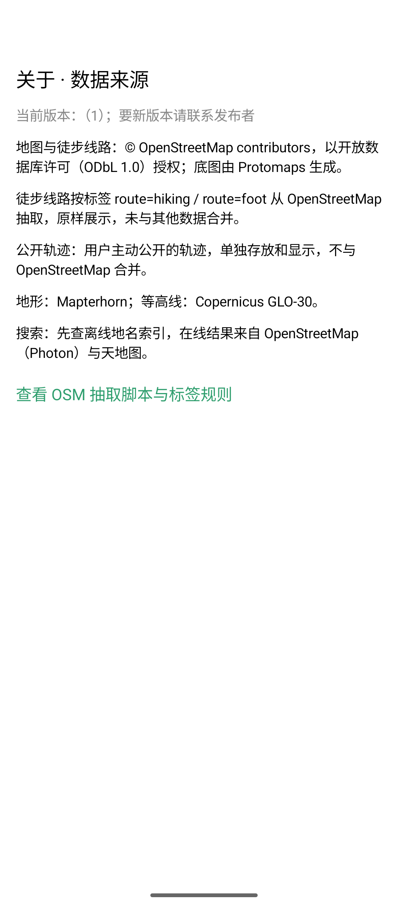
```
'关于 · 数据来源'  [42,170][394,245]
'当前版本：（1）；要新版本请联系发布者'  [42,277][674,329]
'地图与徒步线路：© OpenStreetMap contributors，以开放数据库许可（ODbL 1.0）授权；底图由 Protomaps 生成。'  [42,361][1038,465]
'徒步线路按标签 route=hiking / route=foot 从 OpenStreetMap 抽取，原样展示，未与其他数据合并。'  [42,497][1038,601]
'公开轨迹：用户主动公开的轨迹，单独存放和显示，不与 OpenStreetMap 合并。'  [42,633][1038,737]
'地形：Mapterhorn；等高线：Copernicus GLO-30。'  [42,769][862,821]
'搜索：先查离线地名索引，在线结果来自 OpenStreetMap（Photon）与天地图。'  [42,853][1038,957]
'查看 OSM 抽取脚本与标签规则' C [42,957][1038,1104]
```

## ⑦ 横向：无网络、无定位、空状态
### 7-01-offline-map-home
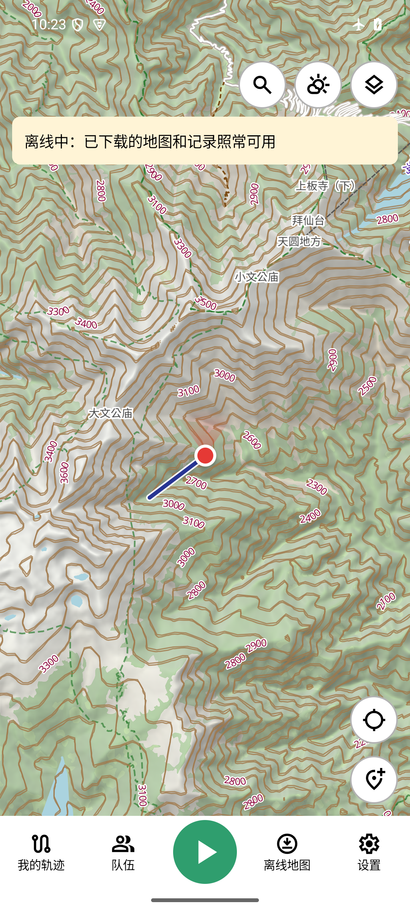
```
'离线中：已下载的地图和记录照常可用'  [64,342][1016,398]
```
### 7-02-offline-search

```
'离线中：已下载的地图和记录照常可用'  [64,342][1016,398]
'taibai' C [74,164][1006,290]
'没有找到（没有网络）'  [42,304][352,349]
```
### 7-03-offline-satellite

```
'卫星图离线用不了 · 切到地形'  [64,342][915,398]
'+1'  [972,347][1016,394]
'地形'  [74,1377][158,1438]
'国内可离线'  [74,1438][229,1483]
'卫星'  [413,1377][497,1438]
'离线仅显示已缓存区域'  [413,1438][667,1528]
'标准'  [752,1377][836,1438]
'离线仅显示已缓存区域'  [752,1438][1006,1528]
'等高线'  [42,1603][996,1664]
'开'  [996,1603][1038,1664]
'山体阴影'  [42,1750][996,1811]
'开'  [996,1750][1038,1811]
'3D 地形'  [42,1897][996,1958]
'关'  [996,1897][1038,1958]
'周边路网'  [42,2044][996,2105]
'关'  [996,2044][1038,2105]
'已叠加 1 条'  [826,2191][1038,2252]
'taibai' C [74,164][1006,290]
'没有找到（没有网络）'  [42,304][352,349]
```
### 7-04-location-off-offline
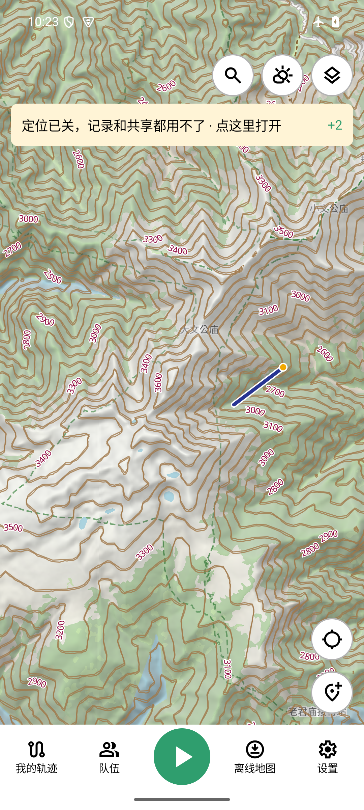
```
'定位已关，记录和共享都用不了 · 点这里打开'  [64,342][915,398]
'+2'  [972,347][1016,394]
```
### 7-05-start-location-off
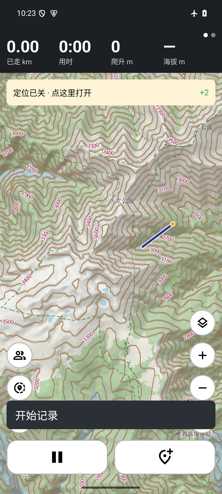
```
'0.00'  [32,181][190,273]
'已走 km'  [32,273][155,322]
'0:00'  [286,181][443,273]
'用时'  [286,273][354,322]
'0'  [540,181][585,273]
'爬升 m'  [540,273][646,322]
'—'  [794,181][853,273]
'海拔 m'  [794,273][900,322]
'定位已关 · 点这里打开'  [64,421][915,477]
'+2'  [972,426][1016,473]
'分享位置'  [64,1853][127,1916]
'更多'  [64,2011][127,2074]
'放大'  [954,1695][1017,1758]
'缩小'  [954,1853][1017,1916]
'暂停'  [236,2179][320,2263]
```
### 7-06-end-empty-recording
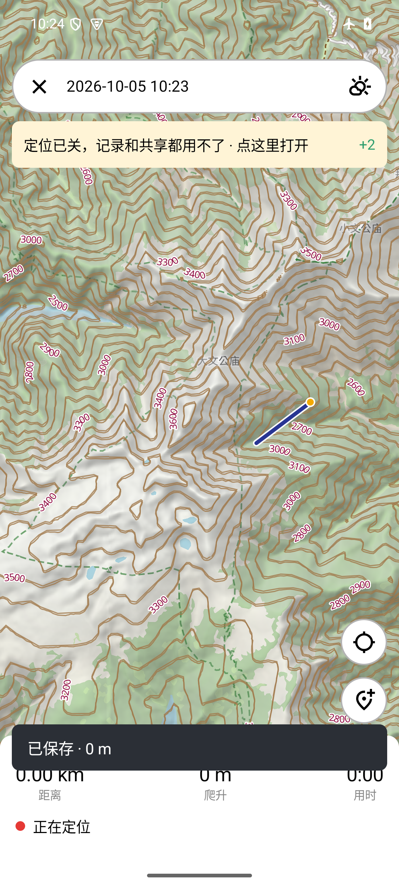
```
'关闭轨迹'  [75,203][138,266]
'2026-10-05 10:23'  [180,209][512,258]
'沿途天气'  [943,203][1006,266]
'定位已关，记录和共享都用不了 · 点这里打开'  [64,363][915,419]
'+2'  [972,368][1016,415]
'0.00 km'  [42,2065][228,2127]
'距离'  [104,2127][166,2172]
'0 m'  [539,2065][627,2127]
'爬升'  [552,2127][614,2172]
'0:00'  [938,2065][1038,2127]
'用时'  [957,2127][1019,2172]
'正在定位'  [89,2207][245,2263]
'已保存 · 0 m'  [74,1992][1048,2053]

（观察）定位关闭时仍可开始记录；结束后保存了一条 0 m 的轨迹并提示「已保存 · 0 m」。
```
### 7-07-empty-tracks

```
'轨迹'  [42,273][540,420]
'标注' C [540,273][1038,420]
'还没有轨迹。开始记录，或导入轨迹文件'  [42,462][690,514]
'导入轨迹文件' C [42,2113][1038,2239]
'支持 GPX、KML、FIT、GeoJSON、PLT'  [42,2250][1038,2295]
```
### 7-08-touch-through（观察：在「我的轨迹」页点空白处 (985,2052)，触发了下层地图的「标注」按钮，页上弹出「已标注」）

```
'轨迹'  [42,273][540,420]
'标注' C [540,273][1038,420]
'还没有轨迹。开始记录，或导入轨迹文件'  [42,462][690,514]
'导入轨迹文件' C [42,2113][1038,2239]
'支持 GPX、KML、FIT、GeoJSON、PLT'  [42,2250][1038,2295]
'已标注'  [74,1981][752,2042]
'撤销' C [752,1938][900,2085]
'补充' C [900,1938][1048,2085]
```
### 7-09-empty-offline

```
'共 20 MB'  [42,273][189,325]
'basemap.pmtiles'  [42,406][322,449]
'6.8 MB'  [42,449][138,486]
'删除' C [902,372][1038,519]
'contours.pmtiles'  [42,605][316,648]
'7.5 MB'  [42,648][138,685]
'删除' C [902,571][1038,718]
'dem.pmtiles'  [42,804][243,847]
'5.5 MB'  [42,847][138,884]
'删除' C [902,770][1038,917]
'导入离线地图文件' C [42,2169][1038,2295]

（观察）清除应用数据后离线地图页仍列出 3 个 pmtiles 文件（共 20 MB）。
```
### 7-10-empty-waypoints

```
'轨迹' C [42,273][540,420]
'新建标注组' C [42,420][1038,567]
'未命名标注'  [42,596][222,648]
'2026-10-05 10:24'  [42,648][280,685]
'已叠加' C [849,567][1038,714]
```

## ⑧ 连上服务端后补截

- 天气（我的位置、轨迹沿途）正常显示，数据来自和风天气；天气页内容一屏放下，不能滚动。
- 在线搜索 `taibaishan`：第一条是拔仙台，没有「太白山」本身；结果混有湖北、广东、香港等地的同音山名。
- **没登录点「建队」：弹出 Toast「使用队伍需要先用手机号登录」，但账号页被队伍页盖住，看不到**（代码里账号页叠在队伍页下面）。第一轮里「建队 / 加入没有反应」就是这个原因，与网络无关。
- 登录之后的队伍各屏见「⑨ 队伍路径」。

### 8-01-weather-online

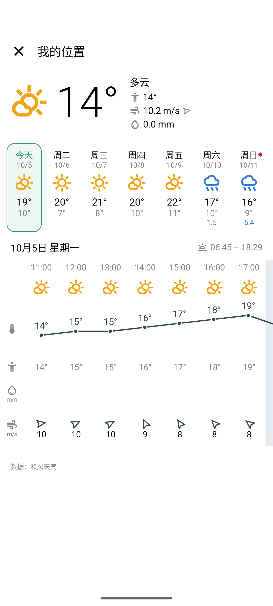

```
'关闭天气'  [43,171][106,234]
'我的位置'  [148,167][336,236]
'多云'  [42,332][189,479]
'14°'  [221,307][471,504]
'多云'  [513,296][591,352]
'体感'  [513,364][555,406]
'14°'  [566,363][619,406]
'阵风'  [513,418][555,460]
'10.2 m/s'  [566,417][711,460]
'风向'  [719,417][762,460]
'降水'  [513,472][555,514]
'0.0 mm'  [566,471][689,514]
'今天'  [62,588][130,637]
'10/5'  [66,637][126,671]
'19°'  [66,777][125,824]
'10°'  [70,824][121,864]
' '  [92,864][99,898]
'周二'  [211,588][279,637]
'10/6'  [215,637][275,671]
'20°'  [215,777][274,824]
'7°'  [229,824][261,864]
' '  [241,864][248,898]
'周三'  [359,588][427,637]
'10/7'  [363,637][423,671]
'21°'  [364,777][423,824]
'8°'  [377,824][409,864]
' '  [390,864][397,898]
'周四'  [507,588][575,637]
'10/8'  [511,637][571,671]
'20°'  [512,777][571,824]
'10°'  [516,824][567,864]
' '  [538,864][545,898]
'周五'  [655,588][723,637]
'10/9'  [659,637][719,671]
'22°'  [660,777][719,824]
'11°'  [664,824][715,864]
' '  [686,864][693,898]
'周六'  [803,588][871,637]
'10/10'  [799,637][875,671]
'17°'  [808,777][867,824]
'10°'  [812,824][863,864]
'1.5'  [818,864][857,898]
'周日'  [951,588][1019,637]
'10/11'  [947,637][1023,671]
'16°'  [956,777][1015,824]
'9°'  [969,824][1001,864]
'5.4'  [966,864][1005,898]
'10月5日 星期一'  [42,951][779,1007]
'日出日落'  [779,958][821,1000]
'06:45 – 18:29'  [832,959][1038,999]
'气温'  [24,1278][71,1325]
'体感'  [24,1431][71,1478]
'降水'  [24,1522][71,1569]
'mm'  [28,1569][68,1597]
'阵风'  [24,1659][71,1706]
'm/s'  [27,1706][68,1734]
'11:00'  [95,1039][232,1091]
'12:00'  [232,1039][369,1091]
'13:00'  [369,1039][506,1091]
'14:00'  [506,1039][643,1091]
'15:00'  [643,1039][780,1091]
'16:00'  [780,1039][917,1091]
'17:00'  [917,1039][1054,1091]
'18:00'  [1054,1039][1080,1091]
'多云'  [130,1105][198,1173]
'多云'  [267,1105][335,1173]
'多云'  [404,1105][472,1173]
'多云'  [541,1105][609,1173]
'多云'  [678,1105][746,1173]
'多云'  [815,1105][883,1173]
'多云'  [952,1105][1020,1173]
'14°'  [138,1434][189,1474]
'15°'  [275,1434][326,1474]
'15°'  [412,1434][463,1474]
'16°'  [549,1434][600,1474]
'17°'  [686,1434][737,1474]
'18°'  [823,1434][874,1474]
'19°'  [960,1434][1011,1474]
'风向'  [137,1650][190,1703]
'10'  [145,1700][183,1740]
'风向'  [269,1645][332,1708]
'10'  [282,1700][320,1740]
'风向'  [406,1645][469,1708]
'10'  [419,1700][457,1740]
'风向'  [543,1645][606,1708]
'9'  [565,1700][584,1740]
'风向'  [679,1644][744,1709]
'8'  [702,1700][721,1740]
'风向'  [815,1643][882,1710]
'8'  [839,1700][858,1740]
'风向'  [953,1644][1018,1709]
'8'  [976,1700][995,1740]
'数据：和风天气'  [42,1828][224,1865]
```

### 8-02-track-weather-online

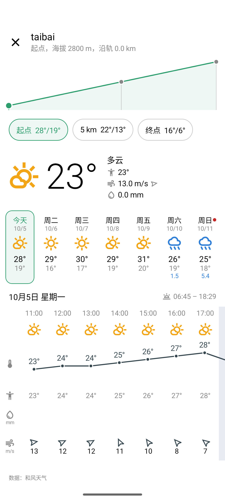

```
'关闭轨迹'  [75,203][138,266]
'taibai'  [180,254][284,258]
'沿途天气'  [943,203][1006,266]
'关闭天气'  [43,171][106,234]
'taibai'  [148,149][263,205]
'起点，海拔 2800 m，沿轨 0.0 km'  [148,205][652,254]
'起点  28°/19°'  [79,596][290,648]
'5 km  22°/13°'  [385,600][603,643]
'终点  16°/6°'  [698,596][889,648]
'多云'  [42,773][189,920]
'23°'  [221,748][471,945]
'多云'  [513,737][591,793]
'体感'  [513,805][555,847]
'23°'  [566,804][619,847]
'阵风'  [513,859][555,901]
'13.0 m/s'  [566,858][711,901]
'风向'  [719,858][762,901]
'降水'  [513,913][555,955]
'0.0 mm'  [566,912][689,955]
'今天'  [62,1029][130,1078]
'10/5'  [66,1078][126,1112]
'28°'  [66,1218][125,1265]
'19°'  [70,1265][121,1305]
' '  [92,1305][99,1339]
'周二'  [211,1029][279,1078]
'10/6'  [215,1078][275,1112]
'29°'  [215,1218][274,1265]
'16°'  [219,1265][270,1305]
' '  [241,1305][248,1339]
'周三'  [359,1029][427,1078]
'10/7'  [363,1078][423,1112]
'30°'  [364,1218][423,1265]
'17°'  [368,1265][419,1305]
' '  [390,1305][397,1339]
'周四'  [507,1029][575,1078]
'10/8'  [511,1078][571,1112]
'29°'  [512,1218][571,1265]
'19°'  [516,1265][567,1305]
' '  [538,1305][545,1339]
'周五'  [655,1029][723,1078]
'10/9'  [659,1078][719,1112]
'31°'  [660,1218][719,1265]
'20°'  [664,1265][715,1305]
' '  [686,1305][693,1339]
'周六'  [803,1029][871,1078]
'10/10'  [799,1078][875,1112]
'26°'  [808,1218][867,1265]
'19°'  [812,1265][863,1305]
'1.5'  [818,1305][857,1339]
'周日'  [951,1029][1019,1078]
'10/11'  [947,1078][1023,1112]
'25°'  [956,1218][1015,1265]
'18°'  [960,1265][1011,1305]
'5.4'  [966,1305][1005,1339]
'10月5日 星期一'  [42,1392][779,1448]
'日出日落'  [779,1399][821,1441]
'06:45 – 18:29'  [832,1400][1038,1440]
'气温'  [24,1719][71,1766]
'体感'  [24,1872][71,1919]
'降水'  [24,1963][71,2010]
'mm'  [28,2010][68,2038]
'阵风'  [24,2100][71,2147]
'm/s'  [27,2147][68,2175]
'11:00'  [95,1480][232,1532]
'12:00'  [232,1480][369,1532]
'13:00'  [369,1480][506,1532]
'14:00'  [506,1480][643,1532]
'15:00'  [643,1480][780,1532]
'16:00'  [780,1480][917,1532]
'17:00'  [917,1480][1054,1532]
'18:00'  [1054,1480][1080,1532]
'多云'  [130,1546][198,1614]
'多云'  [267,1546][335,1614]
'多云'  [404,1546][472,1614]
'多云'  [541,1546][609,1614]
'多云'  [678,1546][746,1614]
'多云'  [815,1546][883,1614]
'多云'  [952,1546][1020,1614]
'23°'  [138,1875][189,1915]
'24°'  [275,1875][326,1915]
'24°'  [412,1875][463,1915]
'25°'  [549,1875][600,1915]
'26°'  [686,1875][737,1915]
'27°'  [823,1875][874,1915]
'28°'  [960,1875][1011,1915]
'风向'  [137,2091][190,2144]
'13'  [145,2141][183,2181]
'风向'  [269,2086][332,2149]
'12'  [282,2141][320,2181]
'风向'  [406,2086][469,2149]
'12'  [419,2141][457,2181]
'风向'  [543,2086][606,2149]
'11'  [556,2141][594,2181]
'风向'  [679,2085][744,2150]
'10'  [693,2141][731,2181]
'风向'  [815,2084][882,2151]
'8'  [839,2141][858,2181]
'风向'  [953,2085][1018,2150]
'7'  [976,2141][995,2181]
'数据：和风天气'  [42,2269][224,2306]
```

### 8-03-nearby-trails-on（打开周边路网后的地图；屏上无可读文字）

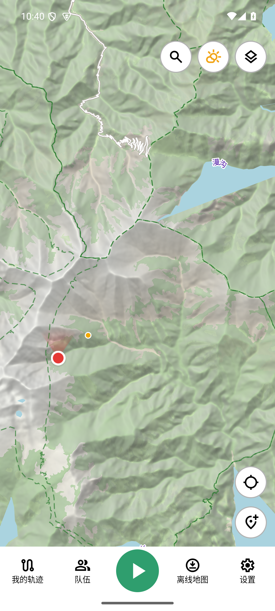

### 8-04-search-online


```
'taibaishan' C [74,164][1006,283]
'拔仙台'  [42,309][150,361]
'陕西省 宝鸡市'  [42,361][236,406]
'宝鸡太白山机场'  [42,458][294,510]
'陕西省 宝鸡市'  [42,510][236,555]
'太白店'  [42,607][150,659]
'甘肃省 东岔镇 麦积区'  [42,659][337,704]
'泰家山'  [42,756][150,808]
'甘肃省 礼县'  [42,808][205,853]
'太子山'  [42,905][150,957]
'湖北省 荆门市'  [42,957][236,1002]
'太干山'  [42,1054][150,1106]
'湖北省 黄冈市'  [42,1106][236,1151]
'台子山'  [42,1203][150,1255]
'山西省 大同市'  [42,1255][236,1300]
'太白园街道'  [42,1352][222,1404]
'江西省 珠山区 景德镇市'  [42,1404][368,1449]
'太宝山'  [42,1501][150,1553]
'广东省 清远市'  [42,1553][236,1598]
'大蚊山'  [42,1650][150,1702]
'广东省 新城镇 新兴县'  [42,1702][337,1747]
'太姥山镇'  [42,1799][186,1851]
'福建省 福鼎市'  [42,1851][236,1896]
'大坳山 Tai Au Shan'  [42,1948][349,2000]
'香港 Hong Kong'  [42,2000][265,2045]
'大環山 Tai Wan Shan'  [42,2097][378,2149]
'香港 Hong Kong'  [42,2149][265,2194]
'塔班山'  [42,2246][150,2295]
```

### 8-05-create-team-online


```
'一次出行的群聊：聊天、发位置，互相看到在哪。建队后把 4 位加入码告诉队友，队友输入即可加入。'  [42,273][1038,363]
'你在队伍里的称呼（可不填）'  [42,405][510,457]
'建队' C [42,597][1038,723]
'加入码'  [42,760][150,812]
'加入' C [42,952][1038,1078]
```

### 8-06-create-team-toast


### 8-07-after-back（按一次返回后仍是队伍页）

```
'一次出行的群聊：聊天、发位置，互相看到在哪。建队后把 4 位加入码告诉队友，队友输入即可加入。'  [42,273][1038,363]
'你在队伍里的称呼（可不填）'  [42,405][510,457]
'建队' C [42,597][1038,723]
'加入码'  [42,760][150,812]
'加入' C [42,952][1038,1078]
```

## ⑨ 队伍路径（测试号 + 队友脚本）

用测试号 13900000001 在模拟器上登录、建队（加入码 1080），`scripts/fake-teammate.py` 以 13900000002「小李」加入，每 4 s 走约 50 m，第 35 步停止共享（#135）。

- 登录：获取验证码后按钮变为「重新获取（56 秒）」，填固定码登录后回到设置页；账号页显示「已登录」，**同步默认为开**。
- 建队后直接进入队伍对话（整页），标题「队伍 1080 · 1 人」。
- **实时更新不工作（已修复，见 ⑩）**：队友加入、上报位置、发消息后，对话和地图都没有变化（等了 20 s 以上）；重启 App 后才出现「2 人」、队友圆点、尾迹和消息，之后又不再动。原因：9443 端口前面的 nginx 没有转发 WebSocket 的 Upgrade 请求头（直连 8080 能握手成功），见 bug issue。
- 底栏「队伍」显示人数「队伍 2」并带红点；队友停止共享后显示「队伍 1」。
- 点队友圆点出现底部卡片：「小李 / 已停止共享 · 11:05 / 1.30 km · 东北 · 电量 46%」。
- 对话中的位置消息显示为「位置 · 距你 708 m · 点这里看」。
- 队伍信息页：加入码、邀请、成员、停止共享我的位置、省电模式、队伍轨迹、结束行程、退出队伍，都在一页上。
- 「结束行程」第一次点击后变为「再点一次，结束所有人的位置共享」，3 s 后自动复原。第二次点击后服务端已结束行程，但界面没有任何变化（结束成功后不做任何事，靠实时推送更新）；重启 App 后对话标题显示「行程已结束 · 队伍信息」。地图上队友的圆点仍在。

### 9-01-test-code-sent


```
'惯用手'  [42,363][660,398]
'右手' C [681,363][849,441]
'左手' C [870,363][1038,441]
'地图缓存 2.2 MB'  [42,505][74,566]
'清除' C [912,473][1038,597]
'256 MB' C [135,588][344,597]
'1 GB' C [365,588][518,597]
'4 GB' C [539,588][692,597]
'在线看过的地方离线时尽力显示，最久未用的先删。缓存不保证离线可用，要离线请下载离线包。'  [42,735][1038,825]
'防止手机在后台停掉记录' C [42,825][1038,952]
'账号与同步' C [42,1078][1038,1119]
'关于' C [42,1119][1038,1266]
'账号'  [42,170][156,252]
'仅支持中国大陆手机号（+86）。登录后才能使用队伍和同步，其余功能无需登录；未登录时数据只存在本机。'  [42,273][1038,363]
'手机号'  [42,405][150,457]
'13900000001' C [74,462][1006,588]
'重新获取（56 秒）' C [42,597][1038,723]
'验证码'  [42,760][150,812]
'登录' C [42,952][1038,1078]
```

### 9-02-logged-in


```
'惯用手'  [42,337][660,398]
'右手' C [681,294][849,441]
'左手' C [870,294][1038,441]
'地图缓存 2.2 MB'  [42,505][912,566]
'清除' C [912,473][1038,599]
'上限'  [42,625][114,677]
'256 MB' C [135,588][344,714]
'1 GB' C [365,588][518,714]
'4 GB' C [539,588][692,714]
'在线看过的地方离线时尽力显示，最久未用的先删。缓存不保证离线可用，要离线请下载离线包。'  [42,735][1038,825]
'防止手机在后台停掉记录' C [42,825][1038,972]
'账号与同步' C [42,972][1038,1119]
'关于' C [42,1119][1038,1266]
```

### 9-03-account-logged-in


```
'惯用手'  [406,337][660,346]
'右手' C [681,294][849,346]
'左手' C [870,294][1038,346]
'地图缓存 2.2 MB'  [42,505][912,559]
'清除' C [912,493][1038,559]
'上限'  [42,649][114,665]
'256 MB' C [135,649][344,665]
'1 GB' C [365,649][518,665]
'4 GB' C [539,649][692,665]
'在线看过的地方离线时尽力显示，最久未用的先删。缓存不保证离线可用，要离线请下载离线包。'  [42,791][1038,802]
'防止手机在后台停掉记录' C [42,928][1038,972]
'账号与同步' C [42,972][1038,1005]
'关于' C [42,1131][1038,1266]
'账号'  [42,170][156,252]
'已登录：13900000001'  [42,294][406,346]
'同步'  [42,389][996,450]
'开'  [996,389][1038,450]
'上次同步 11:02'  [42,493][250,538]
'同步轨迹和标注（含照片）；离线地图和设置不同步。第一次开启时会上传本机已有的数据。'  [42,559][1038,649]
'照片：仅在 Wi-Fi 下上传' C [42,665][1038,791]
'退出登录' C [42,802][1038,928]
'退出登录后，轨迹和标注仍保留在本机，只是不再同步。'  [42,944][817,989]
'注销账号' C [42,1005][1038,1131]
```

### 9-04-team-created


```
'返回' C [11,128][159,275]
'队伍 1080 · 1 人'  [180,147][493,211]
'队伍信息'  [180,211][304,256]
'发送' C [912,2068][1048,2194]
'发我的位置' C [32,2195][529,2321]
'图片' C [550,2195][1048,2321]
```

### 9-05-chat-mate-joined


```
'返回' C [11,128][159,275]
'队伍 1080 · 1 人'  [180,147][493,211]
'队伍信息'  [180,211][304,256]
'发送' C [912,2068][1048,2194]
'发我的位置' C [32,2195][529,2321]
'图片' C [550,2195][1048,2321]
```

### 9-06-map-with-mate

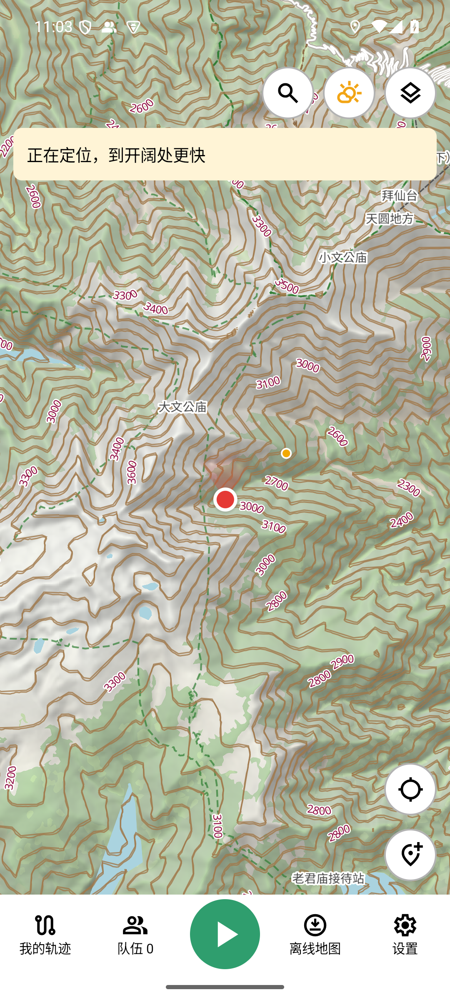

```
'正在定位，到开阔处更快'  [64,342][1016,398]
'队伍 0'  [281,2252][368,2297]
```

### 9-07-relaunch-map

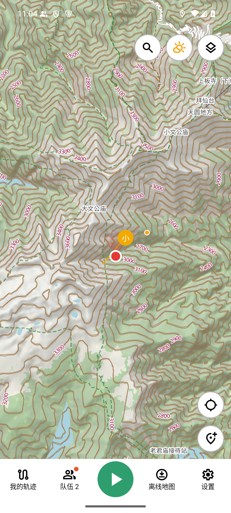

```
'小'  [569,1086][605,1138]
'队伍 2'  [281,2252][368,2297]
```

### 9-08-chat-with-messages


```
'返回' C [11,128][159,275]
'队伍 1080 · 2 人'  [180,147][493,211]
'队伍信息'  [180,211][304,256]
'小李 · 11:03'  [32,286][180,317]
'我到了，跟在后面' C [32,317][396,443]
'发送' C [912,2068][1048,2194]
'发我的位置' C [32,2195][529,2321]
'图片' C [550,2195][1048,2321]
```

### 9-09-team-info


```
'返回' C [42,170][168,317]
'队伍信息'  [168,203][396,285]
'加入码 1080'  [42,328][443,434]
'邀请' C [42,450][1038,576]
'成员 2 人'  [42,613][212,674]
'l'  [75,727][84,770]
'laowang · 我 · 发起人'  [148,717][537,778]
'小'  [61,869][97,921]
'小李'  [148,864][232,925]
'停止共享我的位置' C [42,984][1038,1105]
'省电模式（每 2 分钟上报一次）'  [42,1148][996,1209]
'关'  [996,1148][1038,1209]
'队伍轨迹：没有'  [42,1294][336,1355]
'绑定队伍轨迹' C [42,1371][1038,1497]
'结束行程' C [42,1492][250,1639]
'退出队伍' C [42,1639][250,1786]
```

### 9-10-map-mate-stopped-sharing


```
'小'  [644,996][680,1048]
'队伍 1'  [281,2252][368,2297]
```

### 9-11-mate-sheet

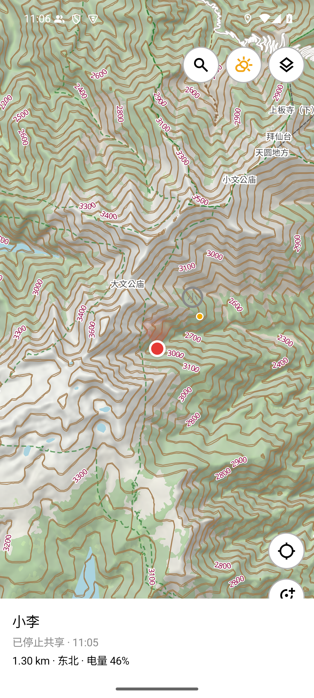

```
'小'  [644,996][680,1048]
'队伍 1'  [281,2295][368,2297]
'小李'  [42,2100][136,2169]
'已停止共享 · 11:05'  [42,2180][338,2232]
'1.30 km · 东北 · 电量 46%'  [42,2243][444,2295]
```

### 9-12-chat-full

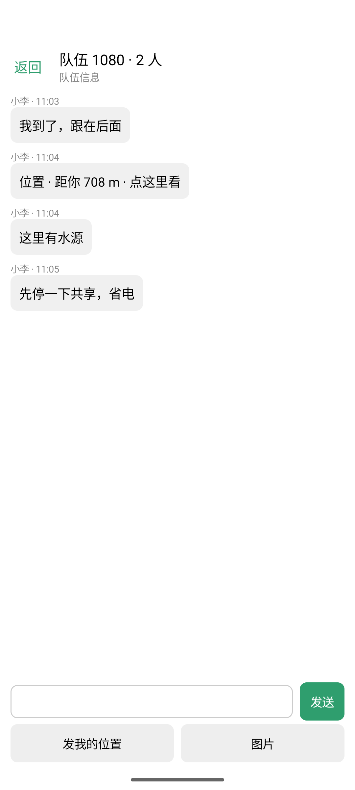

```
'返回' C [11,128][159,275]
'队伍 1080 · 2 人'  [180,147][493,211]
'队伍信息'  [180,211][304,256]
'小李 · 11:03'  [32,286][180,317]
'我到了，跟在后面' C [32,317][396,443]
'小李 · 11:04'  [32,456][180,487]
'位置 · 距你 708 m · 点这里看' C [32,487][576,613]
'小李 · 11:04'  [32,626][180,657]
'这里有水源' C [32,657][279,783]
'小李 · 11:05'  [32,796][180,827]
'先停一下共享，省电' C [32,827][435,953]
'发送' C [912,2068][1048,2194]
'发我的位置' C [32,2195][529,2321]
'图片' C [550,2195][1048,2321]
```

### 9-13-end-trip-confirm


```
'返回' C [42,170][168,317]
'队伍信息'  [168,203][396,285]
'加入码 1080'  [42,328][443,434]
'邀请' C [42,450][1038,576]
'成员 2 人'  [42,613][212,674]
'l'  [75,727][84,770]
'laowang · 我 · 发起人'  [148,717][537,778]
'小'  [61,869][97,921]
'小李'  [148,864][232,925]
'停止共享我的位置' C [42,984][1038,1105]
'省电模式（每 2 分钟上报一次）'  [42,1148][996,1209]
'关'  [996,1148][1038,1209]
'队伍轨迹：没有'  [42,1294][336,1355]
'绑定队伍轨迹' C [42,1371][1038,1497]
'结束行程' C [42,1492][250,1639]
'退出队伍' C [42,1639][250,1786]
```

### 9-15-after-end-trip（服务端已结束，界面没有变化）

```
'返回' C [42,170][168,317]
'队伍信息'  [168,203][396,285]
'加入码 1080'  [42,328][443,434]
'邀请' C [42,450][1038,576]
'成员 2 人'  [42,613][212,674]
'l'  [75,727][84,770]
'laowang · 我 · 发起人'  [148,717][537,778]
'小'  [61,869][97,921]
'小李'  [148,864][232,925]
'停止共享我的位置' C [42,984][1038,1105]
'省电模式（每 2 分钟上报一次）'  [42,1148][996,1209]
'关'  [996,1148][1038,1209]
'队伍轨迹：没有'  [42,1294][336,1355]
'绑定队伍轨迹' C [42,1371][1038,1497]
'结束行程' C [42,1492][250,1639]
'退出队伍' C [42,1639][250,1786]
```

### 9-16-map-after-ended


```
'小'  [644,996][680,1048]
```

### 9-17-chat-after-ended

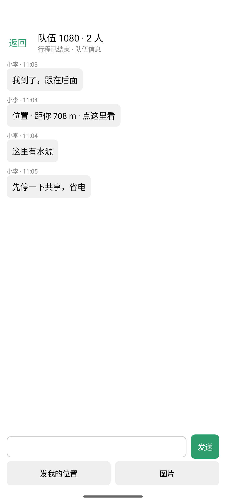

```
'返回' C [11,128][159,275]
'队伍 1080 · 2 人'  [180,147][493,211]
'行程已结束 · 队伍信息'  [180,211][483,256]
'小李 · 11:03'  [32,286][180,317]
'我到了，跟在后面' C [32,317][396,443]
'小李 · 11:04'  [32,456][180,487]
'位置 · 距你 708 m · 点这里看' C [32,487][576,613]
'小李 · 11:04'  [32,626][180,657]
'这里有水源' C [32,657][279,783]
'小李 · 11:05'  [32,796][180,827]
'先停一下共享，省电' C [32,827][435,953]
'发送' C [912,2068][1048,2194]
'发我的位置' C [32,2195][529,2321]
'图片' C [550,2195][1048,2321]
```

## ⑩ 修好反向代理后的实时更新

新建队伍 2687，脚本队友加入、走 30 步、第 22 步停止共享，全程不重启 App：

- 对话页标题即时变为「2 人」，小李的消息即时出现。
- 地图上队友圆点每几秒向东北移动。
- 停止共享后，底栏即时变为「队伍 1」，队友卡片显示「已停止共享 · 11:26」。
- 发起人结束行程后，队伍信息页即时变为「行程已结束，位置共享已停止，对话仍保留」，并出现「新建或加入队伍」。

### 10-01-chat-live-joined


```
'返回' C [11,128][159,275]
'队伍 2687 · 2 人'  [180,147][493,211]
'队伍信息'  [180,211][304,256]
'小李 · 11:25'  [32,286][180,317]
'我到了，跟在后面' C [32,317][396,443]
'发送' C [912,2068][1048,2194]
'发我的位置' C [32,2195][529,2321]
'图片' C [550,2195][1048,2321]
```

### 10-02-map-mate-moving

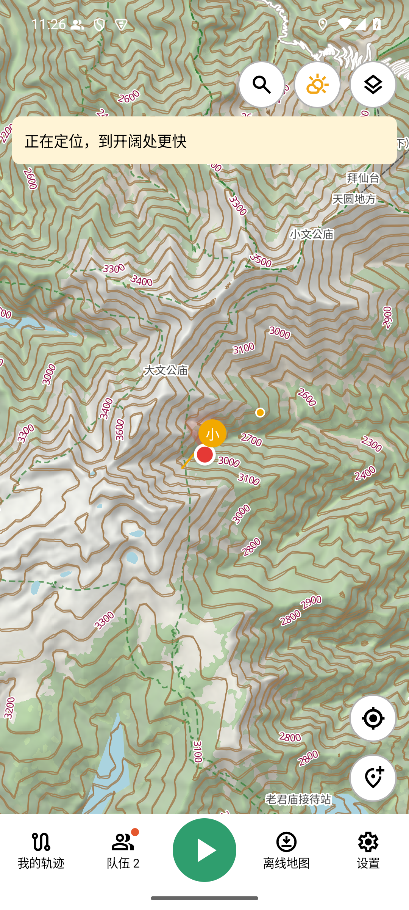

```
'小'  [548,1111][584,1163]
'正在定位，到开阔处更快'  [64,342][1016,398]
'定位：跟随'  [954,1863][1017,1926]
'队伍 2'  [281,2252][368,2297]
```

### 10-03-mate-stopped-live

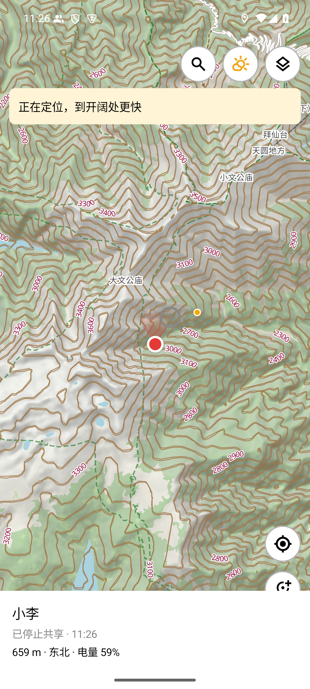

```
'小'  [575,1079][611,1131]
'正在定位，到开阔处更快'  [64,342][1016,398]
'定位：跟随'  [954,1863][1017,1926]
'队伍 1'  [281,2295][368,2297]
'小李'  [42,2100][136,2169]
'已停止共享 · 11:26'  [42,2180][338,2232]
'659 m · 东北 · 电量 59%'  [42,2243][416,2295]
```

### 10-04-after-end-live


```
'返回' C [42,170][168,317]
'队伍信息'  [168,203][396,285]
'行程已结束，位置共享已停止，对话仍保留'  [42,338][631,383]
'成员 2 人'  [42,446][212,507]
'l'  [75,560][84,603]
'laowang · 我 · 发起人'  [148,550][537,611]
'小'  [61,702][97,754]
'小李'  [148,697][232,758]
'新建或加入队伍' C [42,817][1038,943]
'退出队伍' C [42,938][250,1085]
```
